## Consideration of Decred's order books in comparison to other projects

Considering the market maker proposals currently under discussion, some of the big differences between proposals are in regard to the level of liquidity being offered and how far it would be positioned from the price (how tight the spread is).

I have collected order book data for DCR and a number of other cryptoassets, by pulling data from the public APIs of the exchanges every 15 minutes. The aim is to quantify how deep the DCR order books are now, how much of a difference the MM liquidity would make, and how this compares to the liquidity of other selected cryptoassets.

To process this data, I have aggregated the open orders which are 1 to 5% away from the current price, in either direction. In this aggregated data-set, at each snapshot you can see how much DCR (or other asset) was wanted in bids to buy, at -1%, -2%, -3%, -4%, -5% of the current price - and the same on the other side with asks to sell DCR at up to 1-5% over current price.

To enable comparisons between assets, I have converted them to USD equivalent (by manually entering the price on Aug 24, this is rough work).

Data collection has only been up and running for a few days (less for some exchanges/pairs), so this should be considered a preliminary analysis and over a longer timeframe the average liquidity for these pairs may be quite different. 

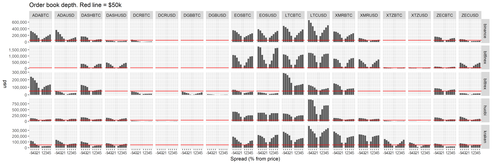

The red line on the bar charts indicates $50k, which is the maximum amount of liquidity that would be provided per pair (by i2, at a 5% spread). Grapefruit is proposing $30k at 1-2% spread. You can see in the graph that this kind of additional availability would make a dramatic difference to the order books for DCR. Other assets considered here have mostly already got that level of availability, on both sides and usually within 1% of the price. The sell side on DCR markets looks particularly weak over this short observation period.

XTZ also has relatively light order books, particularly on the sell side. This may be a reflection of the fact that (delegated) staking is available to Tezos holders and they can earn a share of rewards for doing so. 

DCR's order books for some markets are barely visible on this graph (there are also some where it's not listed), so here's a DCR only version:

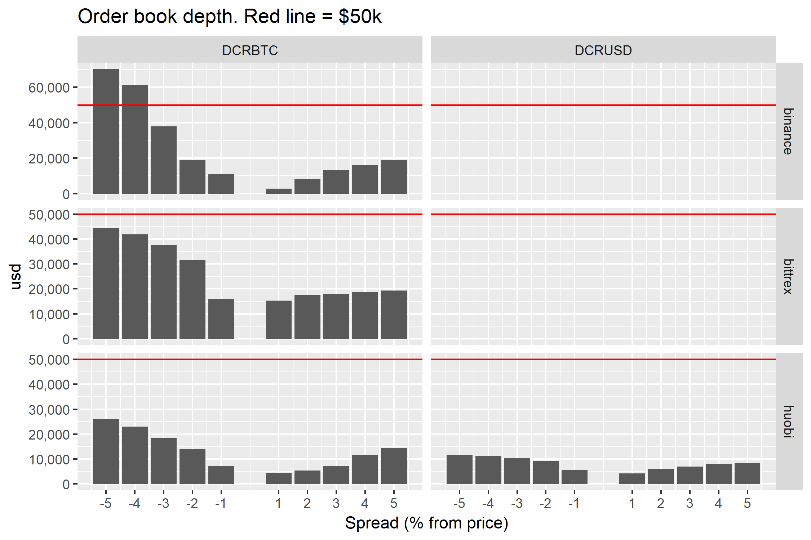

DCR has the smallest market cap of the considered assets, so it is not reasonable to make a straight comparison with their order books. To make a fairer comparison, I have expressed the order book values as a percentage of the asset's total market cap.

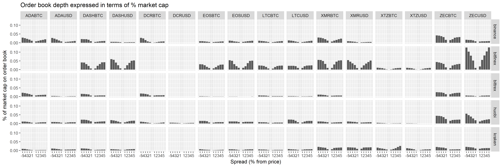

DCR order books still look thin relative to other assets, but after taking market cap into account the disparity is not as great.

The table below shows the mean observed size of orders up to 5% from the current price on each side (-5% is buy side). If you wanted or were willing to move the price by 5% to get (rid of) some of the asset, this is how much you would need (in USD). The formatting is rough because it's dumped directly from a script, but this allows it to be easily updated (the [csv file](data/xtabs-liquidity-at-5.csv) this is based on is more likely to be updated).

|Pair   |binance_-5|binance_5|bitfinex_-5|bitfinex_5|bittrex_-5|bittrex_5|huobi_-5|huobi_5|kraken_-5|kraken_5|
|-------|----------|---------|-----------|----------|----------|---------|--------|-------|---------|--------|
|ADABTC |366       |247      |NA         |NA        |275       |135      |140     |93     |118      |31.9    |
|ADAUSD |343       |125      |NA         |NA        |45.2      |27.4     |105     |88.2   |142      |79      |
|DASHBTC|172       |79.6     |339        |349       |129       |56.9     |183     |99.8   |98.6     |38      |
|DASHUSD|42        |25.2     |500        |437       |NA        |NA       |158     |136    |60.5     |62.9    |
|DCRBTC |70.3      |18.7     |NA         |NA        |44.5      |19.3     |26.2    |14.3   |NA       |NA      |
|DCRUSD |NA        |NA       |NA         |NA        |NA        |NA       |11.6    |8.26   |NA       |NA      |
|EOSBTC |289       |241      |1010       |949       |69.4      |39.6     |483     |251    |227      |129     |
|EOSUSD |384       |361      |1750       |1670      |32        |21.2     |384     |320    |224      |223     |
|LTCBTC |512       |414      |1090       |1070      |295       |142      |350     |260    |265      |169     |
|LTCUSD |616       |510      |1030       |1120      |138       |98.3     |1040    |697    |376      |337     |
|XMRBTC |401       |313      |759        |717       |155       |84.1     |158     |105    |275      |225     |
|XMRUSD |118       |59.8     |737        |701       |NA        |NA       |162     |101    |243      |244     |
|XTZBTC |NA        |NA       |81.4       |75.6      |NA        |NA       |30.6    |15.6   |118      |193     |
|XTZUSD |NA        |NA       |79.5       |72.5      |NA        |NA       |10.4    |3.31   |98       |47.7    |
|ZECBTC |152       |116      |158        |119       |90.8      |79.1     |159     |81.1   |71.6     |23.7    |
|ZECUSD |61.1      |33.8     |457        |459       |21        |21       |203     |89.4   |74.8     |49.5    |

For DCR there are typically more orders on the buy side ($36k at Binance, $50k at Bittrex, $36k at Huobi across both BTC and USD pairs) than the sell side ($24k Binance, $20k Bittrex, $13k Huobi).

### Fluctuations in order book depth over time

This section is about establishing whether order book depth is relatively stable or not, and  deciding what an appropriate delay is between data snapshots. 

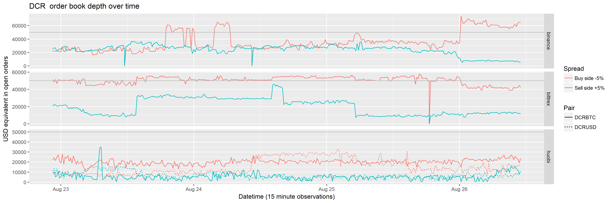

The lines show how the size of orders on the books (in USD) on each side, data recorded at 15 minute intervals. The sell side varies quite significantly over this observation period, between $10k and $30k at Bittrex, $10k-$20k at Binance, and steadily under $10k at Huobi, except for short periods where more DCR appears for sale.

I have produced equivalent graphs for all of the assets being tracked, they are in this [folder](img/) (and at the end of this document).

I'm planning to drop the temporal resolution to hourly snapshots and leave some version of these scripts running longer term.

The raw data is in a MySQL database and too large to share easily, but if you want access let me know and I can set you up. The aggregated data-set is [here](data/orderbook-observations-long.csv).

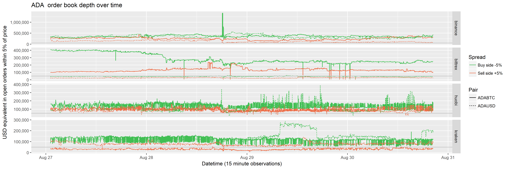
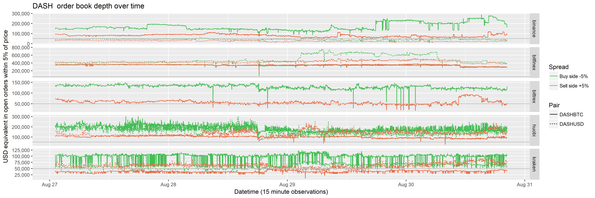
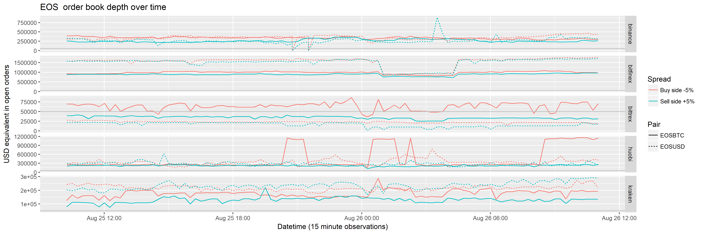
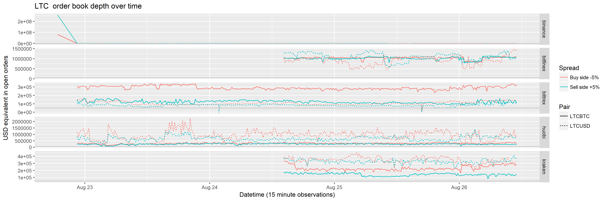
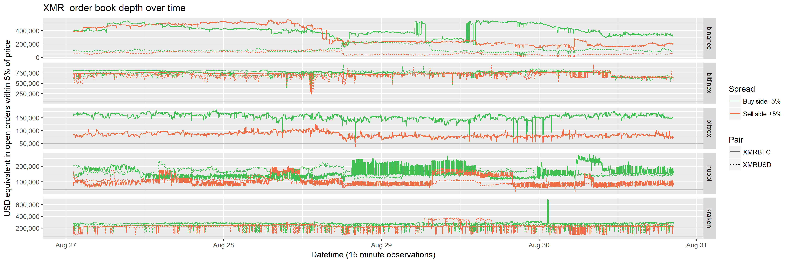
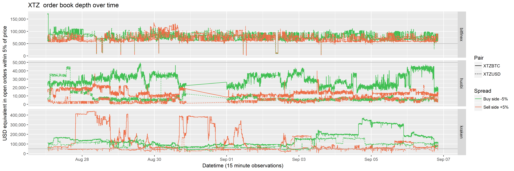
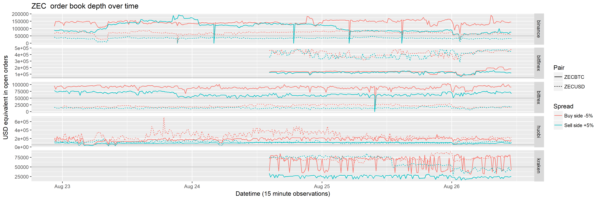
