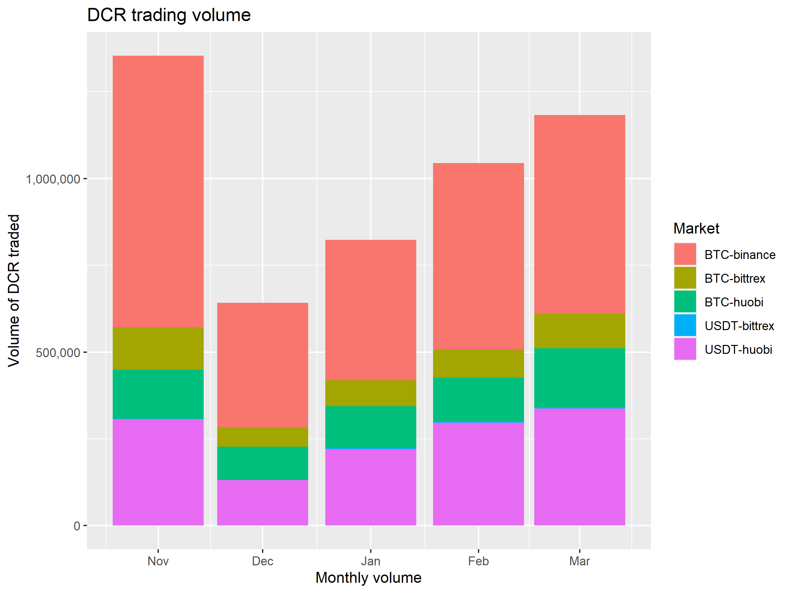

This report considers the last 7 months of the crypto markets, looking specifically at liquidity and the effect of market maker operations on some DCR pairs. It uses data collected from exchanges from August 2019 to April 2020.

See previous reports from this series: {}

I started by looking at the order book depth on DCR markets where the MM operated. This is the same basic method I was using to check how well the MM was performing previously, but now that function has been taken on by Company 0 using i2's own trading data.

This time around I have graphed the USD and BTC pairs separately, using the USD and BTC figures for liquidity (the same as those used in the proposal).

- 3 BTC ($30k) per side within +/-2% of BBO
- 5 BTC ($50k) per side within +/-4% of BBO

There is a discrepancy with my method and i2's specification. I use the mid-point between the best buy and offer as the "price" and recorded orders as being within certain distances of that price. i2's specification is that the liquidity should be within X% of the best buy and offer, taken separately, but the proposals also specifies that the spread between these should be max 0.5% (for BTC pairs) or 0.75% (for USD pairs). So, in addition to the 2% and 4% levels, I also considered the 5% level, as that should cover all the orders within a reasonable distance of the current price. I'm only including the 2% and 5% graphs here.

The graph showing orders within 2% of the current price is just missing i2's orders (which are ~2% from the best bid or offer) but shows what they had available at the tightest spread. 

An issue was identified in the previous report with USD markets being provisioned at "BTC-denominated" rates (i.e. 5 BTC worth of USD rather than $50,000 USD), and as the USD price of Bitcoin had declined this resulted in lower liquidity provision. This was remedied by i2 in Feb, but it appears that in March when the price of everything crashed, so did the liquidity on these markets. 

The other thing which comes across about the USD markets is that the buy and sell sides followed very similar trajectories. This coupled with how closely the line follows the 50k requirement in Feb on Bittrex suggests to me that there were very few open orders on those markets that weren't belonging to i2. 

It should be noted that the Huobi USDT pair was not being covered or billed for for some months after Bitrrex USD coverage began, as it was requested to be swapped over. From December to February this market was not being covered by i2, but they started covering it again in March.

The BTC order books look much more lively by comparison, but they are quite flat over the time period. There is no indication here that liquidity has been improving in USD or BTC terms over the last 5 months, beyond the orders which i2 have added to the books directly.

The next graph shows the order fill history for these markets, which gives context for some of the movements in the order book depth charts.

## Volume

These bar charts show the volume of DCR traded by day and month on the pairs covered by the MM.

The next one shows USD equivalent for filled orders.

Looking at the monthly figures suggests that Nov 2019 was the most active month, this was a month that saw significant price increase for DCR. Trading volume dropped in December as the price also dropped then stabilized. Since then volume has been increasing month on month in DCR terms, mostly driven by expansion at Binance and Huobi.

The Bittrex BTC/DCR market accounted for a small proportion of trading on the covered exchanges, and the Bittrex USDT and USD markets have such small trading volume that they do not appear on the graphs. I don't collect completed order data for Bittrex USD/DCR market but a cursory glance at the state of it indicates that volume is very low.

It seems there is some missing ingredient on Bittrex USD(T) markets, and the result is a bit of a flop. The presence of i2's orders on the books did not result in the arrival of high volume traders to take these offers. 

## Broader market

Let's take a look at what's been happening in the cryptocurrency markets more generally, using some data I started collecting about similar projects for comparison back in August. To compare assets I first converted all figures to USD. This graph shows open orders within 5% of current price for all the BTC and USD pairs for a selection of assets on Binance, Bittrex and Huobi.

This graph shows the time before MM activity started, when the DCR orderbooks were very thin indeed, and you can see the difference when i2 started up in late October.

In this graph the y axis is independent for each asset. This is not great as it can give a misleading sense of equivalence, but without this the DCR lines would all be squashed into the bottom part of the range. The other assets considered here have higher market cap than DCR, so this is to be expected to some degree, but considering where the black line appears in each plot (always at $50K) gives a sense of how much deeper the order books were for the other assets.

Also of interest is the significant increase in order book depth during Q1 2020 for some DASH, XMR and ZEC markets, before a sharp contraction in liquidity across all assets as the prices crashed in mid-March, with a rebound in liquidity after that.

DCR liquidity on BTC markets was relatively unaffected by this, although on USD(T) markets it took a hit and has not yet recovered. i2 have acknowledged issues with maintaining liquidity on these USD markets and the audit tool also picked up on them, resulting in a decrease to the fee being billed by i2 for that time.

To make a general comparison, the DCR chart here looks relatively flat, it is missing the sustained large increase in liquidity that has been associated with times of increased market interest in other assets. 

The next graph shows the same order book depth data but as a proportion of market capitalization for each asset. 

When market cap is controlled for, the DCR markets still don't look great. Also worth noting is that this only considers 3 exchanges, the 3 exchanges with the deepest order books by far. Some of the other assets considered here are also listed on other large exchanges where a significant amount of trading occurs.

## Takeaways

There is no sign of a sustained organic increase in order book depth over the past 5 months, beyond the orders maintained by i2 as part of their Market Making activity.

The volume being traded on some pairs has been quite high relative to before MM started, I don't have equivalent order data from before October for comparison but trading volume was very low then. The daily volume chart shows that trading volume increased sharply on certain days, usually associated with significant price movements. There is not a clear pattern of trading volume increasing over time.

Comparing order book depth with other projects indicates that Decred is still a relatively small fish, even with the i2 orders on the books, and liquidity never really grew much beyond that.