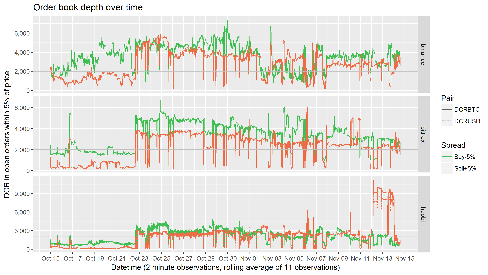
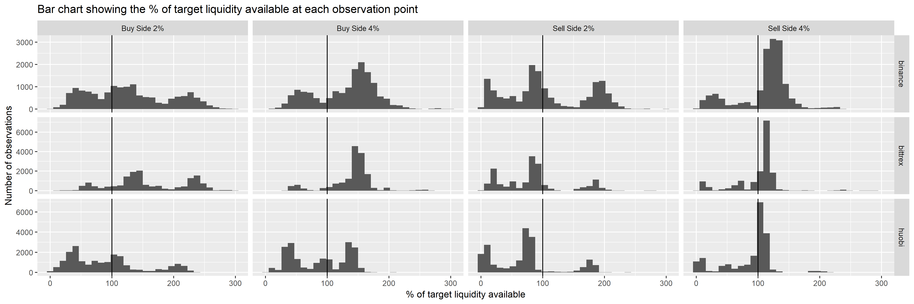
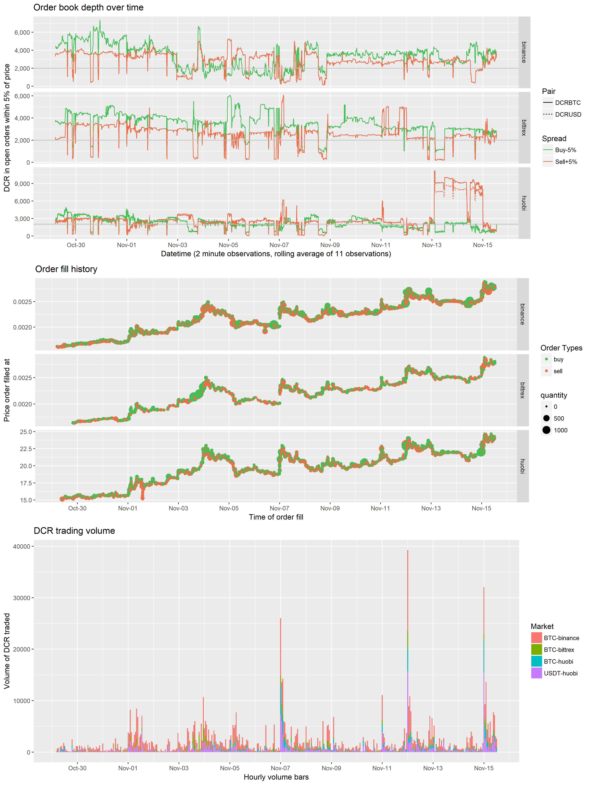

This report considers the DCR order books and market dynamics since the start of market making activities by i2 Trading. 

See this previous report for background on order book data collection and comparison with other projects.

This analysis is based on the publicly available order book data, collected through the APIs of the various exchanges. One of the main objectives was to compare the order books before and after the market making activities began, to ensure that the service is being provided as described and see how it is affecting the markets.

This graph shows the impact of i2's activities on the order books (starting Oct 22). The lines represent the amount available to buy and sell within 5% of the current price, and indeed you can see that around $50k of additional liquidity appeared and has been maintained most of the time since then. The graph also shows that there were some times where the target level of liquidity was not available. This is to be expected to some degree, and the proposal itself promised 90% uptime, aside from exchange outages.

This data represents all of the orders on the books, not just i2's, so while it is possible to know whether the target level of liquidity was present at a specific point in time it is not possible to know whether it was being provided by i2 or another party. 

| exchange | side/depth   | % on target |
| -------- | ------------ | ----------- |
| Binance  | Buy side 2%  | 73%         |
|          | Buy side 4%  | 79%         |
|          | Sell side 2% | 59%         |
|          | Sell side 4% | 84%         |
| Bittrex  | Buy side 2%  | 88%         |
|          | Buy side 4%  | 92%         |
|          | Sell side 2% | 43%         |
|          | Sell side 4% | 84%         |
| Huobi    | Buy side 2%  | 52%         |
|          | Buy side 4%  | 60%         |
|          | Sell side 2% | 43%         |
|          | Sell side 4% | 69%         |

These tables are based on data from Oct 22 to Nov 15, DCR/BTC on Binance, Bittrex and Huobi, and DCRUSDT on Huobi (Bittrex USDT market was added during the observation period but is not considered here). The requirements considered were to have 3 BTC or $30k available within 2%, and 5BTC or $50k available at 4%. The price in each hour was used to set the target amount of DCR which should be available, the table shows the percentage of observations where the target levels of liquidity were available.

Looking at the data at each observation point suggests that the target level of liquidity was available less than half of the time on some exchanges/pairs. In particular the tight sell side orders on Bittrex were only sufficiently there on 43% of observations, this was also the weakest measure on Binance (59%). Uptime on Huobi seems to have been generally not great. 

What these figures don't show is whether the target was missed by a little or a lot. It is possible there are many observations where there was just a little less DCR than the target because a big trade just happened. The next graph shows a breakdown of how far over/under the available liquidity was at each observation, as compared to the target for that hour.

Looking at the sell side 2% target, it is clear that on many observations the order books had around 80-90% of the target liquidity. There are other observations where very little liquidity was available, when presumably i2 were not active in making the market - these are identified by the cluster of bars near 0, representing the state of the order books when i2 are offline.

It is also interesting to consider why the order books got thin at certain points in time, and the degree to which the liquidity provision was available during periods of price volatility. The graph below shows order book depth at the +/- 5% level (top), history of filled orders on 3 pairs (middle), and volume traded per hour  (bottom).

There does seem to be a relationship between price movement and market making down time, with significant moves up in price being followed by a period of low availability on the sell side (perhaps as i2 have to re-fill the exchange account, if they sold a lot of the DCR they held there).

### Response from i2 Trading

I showed the analysis above to i2 Trading and they have pointed out that I am using the spot price for each market and assuming that their orders will be within X% symmetrically either side of this. In practice, i2 base their orders on a price which is aggregated across a number of different exchanges (so as to avoid being in a situation where their orders cross on different exchanges). 

Also, if a big order is filled, when i2 replace the orders they would do so with a spread which is asymmetric around the spot price. For example, if all buy orders were filled at the -2% level across multiple exchanges, the new buy orders may be as low as -4% from the new spot price. The way the data I'm using is recorded makes it hard to look in detail at whether the liquidity was spread a little wider, if it was outside the range I was using it would be missing from my data.

Also, when i2 cancel and replace their orders this takes ~300ms, and it is something they can do as often as every 1 to 2 seconds. When my observations have been recorded during these 300ms movements it will appear as though the orders were not there (and this would be counted as a "miss" using my method), when in practice the orders were still on the books aside from a momentary lapse. In the versions of the order book line graph without the rolling average you can see these temporary drops, and they do account for some proportion of the "misses" in the table.

### Data from i2 Trading

i2 have provided me with spreadsheets containing their completed trades from Binance and Bittrex, it has not been possible to obtain such exports from Huobi. These files do not offer the same level of assurance as read access to their exchange accounts via API. It would be possible for i2 to insert additional rows in these sheets to claim higher trading volume, but it wouldn't be easy to do this without making it obvious and I think it's unlikely they have done so. 

#### Binance

From Oct 22 - Oct 31, i2 traded 17,000 DCR on Binance DCR/BTC market, roughly equal buy and sell orders.

From Nov 1 - Nov 12 i2 traded 63,700 DCR on Binance DCR/BTC market, with slightly more in sell orders (~52%). This means that i2 were involved in about 21% of the trading on this pair during this time.

From Oct 22 - Oct 31, i2 incurred trading fees of 8.5 DCR and 0.014 BTC on Binance - around $250.

From Nov 1 - Nov 12, i2 incurred trading fees of 30.8 DCR and 0.07 BTC on Binance - around $1,300.

#### Bittrex

From Oct 22 - Oct 31, i2 traded 7,000 DCR on Bittrex DCR/BTC market, roughly equal buy and sell orders (~52% buys).

From Oct 22 - Oct 31, i2 traded 3,600 DCR on Bittrex DCR/USDT market, ~57% in sell orders.

From Nov 1 - Nov 12 i2 traded 12,600 DCR on Bittrex DCR/BTC market, ~60% in sell orders. This means that i2 were involved in about 20% of the trading on this pair during this time.

From Nov 1 - Nov 12 i2 traded 770 DCR on Bittrex DCR/USDT market, ~57% in buy orders.

From Oct 22 - Oct 31, i2 incurred trading fees of 0.03 BTC and 140 USDT on Bittrex - around $400.

From Nov 1 - Nov 12 i2 incurred trading fees of 0.06 BTC and 31.5 USD on Bittrex - around $570.

### Conclusion

This report is intended to give some sense of how i2 Trading's market making activity has gone so far. The available data is not great for checking that the uptime of the market making service was on target. There are indications that 90% uptime may not have been achieved on all markets/spreads, but there are also known issues with the available data, and a couple of known ways in which available liquidity could have been missed.

In my view i2 have made a decent effort to provide the market making service so far. The price volatility of early November has presented them with a more challenging scenario in which to maintain their offers. We will see how it goes over the rest of the month.

Following the [announcement](https://twitter.com/BittrexExchange/status/1194330471385186316?s=20) by Bittrex that  a USD pair will be opening on Nob 18, i2 have been instructed to cover this pair instead of one of the Huobi pairs. Since Oct 22 there have been 93,600 DCR traded on the DCR/BTC and 228,300 traded on DCR/USDT - which would suggest retaining the USDT pair.

This also means that a greater proportion of their activity will be covered by the data exports going forward, and overall uptime is likely to increase as Huobi is the exchange where this seems to have struggled most whereas measured "uptime" has been higher on Bittrex.

I will look at improving the way the data is collected and processed for the purpose of monitoring the order books, but without data about which orders on the books belong to i2 it is not possible to know for sure how much of the available liquidity is due to them at any particular point in time.

