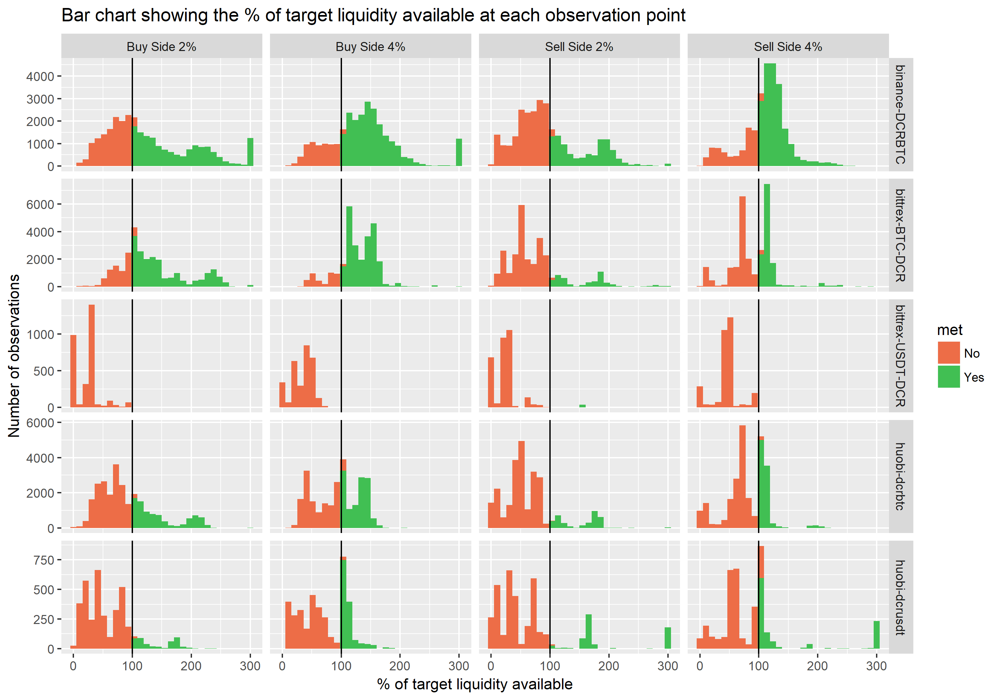
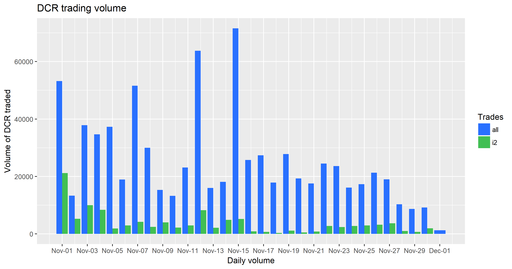
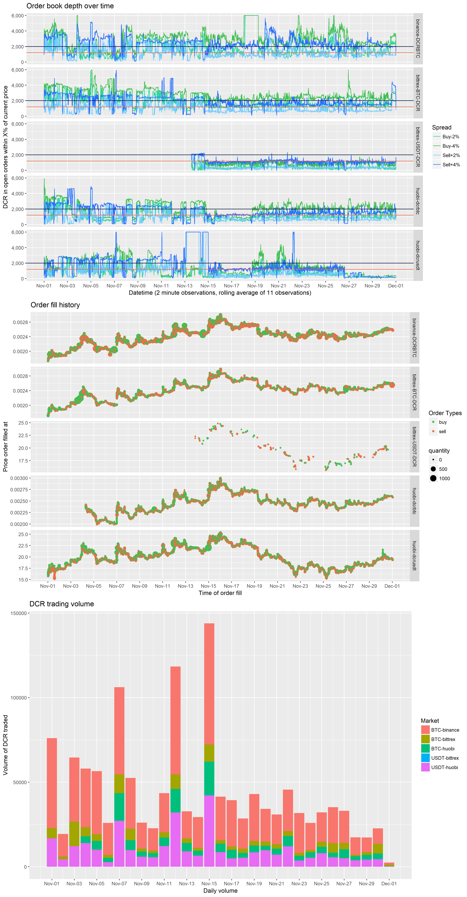
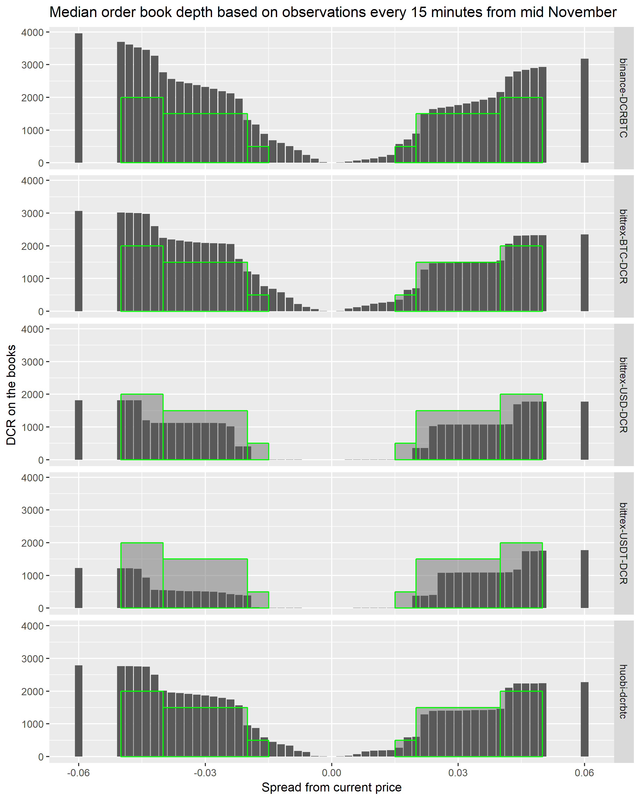

This report considers the DCR order books and market dynamics in November 2019, looking specifically at the market making activities of i2 Trading.

See this previous report for background on order book data collection and early analysis.

This update takes a look at November data and improves upon the analysis in some ways.

The first table looks at each observation (recorded every 2 minutes) and asks whether the promised liquidity was available on the order books at the 2% ($30k each side) and 4% ($50k each side) levels. The target uptime is 90%.

I excluded the Huobi USDT market from Nov 26, as i2 moved their effort to Bittrex instead at this point. As noted previously, this method is a work in progress.

| Exchange | Pair | Side/Depth   | % on target |
| -------- | ---- | ------------ | ----------- |
| Binance  | BTC  | Buy side 2%  | 57          |
|          |      | Buy side 4%  | 79          |
|          |      | Sell side 2% | 38          |
|          |      | Sell side 4% | 77          |
| Bittrex  | BTC  | Buy side 2%  | 77          |
|          |      | Buy side 4%  | 91          |
|          |      | Sell side 2% | 19          |
|          |      | Sell side 4% | 50          |
| Bittrex  | USDT | Buy side 2%  | 0           |
|          |      | Buy side 4%  | 0           |
|          |      | Sell side 2% | 1           |
|          |      | Sell side 4% | 0           |
| Huobi    | BTC  | Buy side 2%  | 36          |
|          |      | Buy side 4%  | 51          |
|          |      | Sell side 2% | 16          |
|          |      | Sell side 4% | 42          |
| Huobi    | USDT | Buy side 2%  | 11          |
|          |      | Buy side 4%  | 23          |
|          |      | Sell side 2% | 14          |
|          |      | Sell side 4% | 24          |

The number of observations where the expected liquidity was available are quite low on some of these markets, in particular the Bittrex USDT market almost never had the target liquidity. 

The sell side, particularly on Binance, had quite a few "near misses", where the level of liquidity was a little lower than the target. These probably reflect occasions where significant orders had just been processed and not yet replaced.

It is interesting to note that on Bittrex and Huobi the sell side availability rarely gets much higher than the target level, suggesting that i2 are often the only large seller in the market.

Bittrex opened a DCR market and i2 started operating there from Nov 19, seeming to switch from the Huobi USDT market to Bittrex USD around Nov 26. I have excluded the Bittrex USD market from this report because it took a while to get going and only 600 DCR was traded by the end of Nov.

In November, according to the spreadsheet I have received, i2 traded 103k DCR on Binance, 36k DCR on bittrex, and 91k DCR on Huobi, incurring fees of 0.33 BTC, 147 DCR, and 530 USD (approximate total: $6,000).

The next graph shows volume observed each day on the exchanges (Bittrex and Huobi USDT data is missing for early Nov) and volume of trades reported by i2. 

i2 were involved in 17% of the volume of the month's trading as observed on these exchanges.

### The big graph

I made several changes to the big graph which aims to pack as much information into one graphic as possible.

The order book depth is now shown at the 2% and 4% levels, along with horizontal lines indicating the minimum threshold for satisfying the target criteria. These are based on the highest observed price (~$25), so 2k DCR is used for the $50k mark and 1,200 is used for the $30k level.

I have added the DCR/USDT pair at Bittrex, and it seems to have relatively low liquidity compared to the other markets i2 are working on.

I have set a maximum of 6,000 DCR on the Y axis for the order book depth, large orders would occasionally see this spiking to 15k+, which was compressing the space for the more typical range.

The volume is now broken down by day rather than by hour. Bittrex USDT data is only available for the second half of the month.

I updated my data collection scripts in mid-November, and using observations of the order books recorded every 15 minutes from then until now, the next graph shows the median order book depth at more fine-grained increments of 0.2%. The graphs show the 0-5% range, and the green boxes represent approximately the depth that should be achieved according to the terms of i2's proposal. Based on this data, they were mostly hitting the targets on Binance and Huobi, although perhaps sometimes with a slightly loose spread (which would mean "misses" using my method above).

However the Bittrex pairs look to have been significantly under-provisioned most of the time. This graph doesn't reflect down-time, which I will be looking at with this more detailed data next time around.

